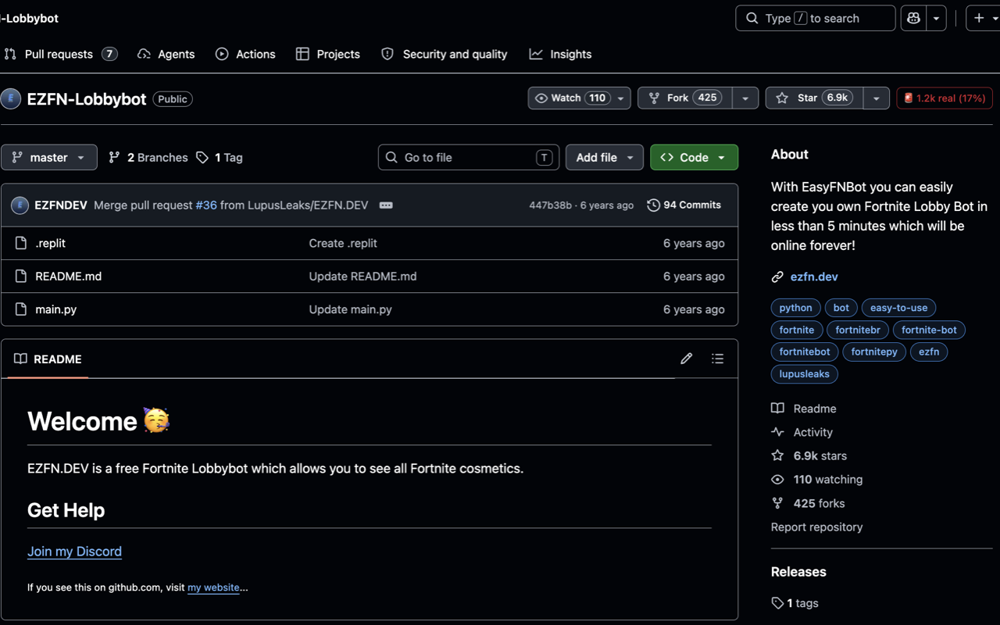

# real-stars

**Chrome extension that exposes fake stars on every GitHub repository you visit.**

[**→ Install free on the Chrome Web Store**](https://chromewebstore.google.com/detail/dhedokmgjhemapgdkekkmkfnnmggdkca)
· [**→ Hall of Shame dashboard**](https://real-stars-hall-of-shame.pages.dev/)

When you open a GitHub repo, real-stars analyzes the star history and the
stargazers' accounts and shows how many stars look real next to the
official star count.

```
[ ⭐ 6.9k ]  [ 🚨 1.2k real (17%) ]   ← LupusLeaks/EZFN-Lobbybot
[ ⭐ 232k ]  [ ✓ 229.1k real (99%) ]  ← torvalds/linux
```



## How it works

Two independent fake-star detection signals, combined via max:

1. **Burst detection.** A sliding-window MAD (median absolute deviation)
   algorithm spots statistically anomalous spikes in the star timeline —
   the fingerprint of "bought a batch in one day". Ported from
   [StarGuard](https://github.com/m-ahmed-elbeskeri/Starguard) (Apache-2.0).

2. **Per-user account analysis.** Samples 400 stargazers and scores each
   account on age, follower count, public repo count, and avatar.
   Catches "drip-fed bought stars from a pool of throwaway accounts" —
   the pattern that burst detection alone misses.

Each detected burst is cross-validated against fork activity and traffic
referrers (HN, Reddit, Twitter); real spikes leave evidence, bought stars
don't.

The displayed verdict takes the larger of the two signals, so a repo gets
flagged whether the fake stars came in a single spike or were spread out
across years.

## Calibration

Validated against [StarScout's published ground truth][starscout]
(ICSE 2026 paper, 13.5k repos labeled via two peer-reviewed heuristics).
real-stars' live algorithm matches StarScout's 2025-01-01 snapshot within
±3% on the test set:

| Repo                     | StarScout (snapshot) | real-stars (live) |
| ------------------------ | -------------------- | ----------------- |
| LupusLeaks/EZFN-Lobbybot | 83.5% fake           | 86.5% fake        |
| microsoft/vscode         | 1.27% fake           | 1.5% fake         |
| torvalds/linux           | 0.88% fake           | 1.5% fake         |

Repos under 1,000 stars get a "needs more data" badge instead of a
verdict — we'd rather under-detect than libel a real project.

[starscout]: https://github.com/hehao98/StarScout

## Dashboard

Live dashboard at [real-stars-hall-of-shame.pages.dev](https://real-stars-hall-of-shame.pages.dev/):

- **Trending** — every repo on github.com/trending (today / this week / this month), scored with the same algorithm. Updated every six hours.
- **Registry** — searchable index of the 13,499 repos flagged by the StarScout paper.

## Status

- [x] MAD burst detection (ported from StarGuard, Apache-2.0)
- [x] Fork ratio + traffic referrer cross-validation
- [x] **Per-user account scoring** on a 400-stargazer global sample (±3.5% CI at 95%)
- [x] One-click GitHub sign-in (OAuth Web Flow via Cloudflare Worker)
- [x] In-page badge injection on repo pages
- [x] Confidence gate at 1000 stars
- [x] Parallel API fetching (analysis ~30s cold, instant on cache hit)
- [x] 30-day per-user + 7-day per-repo caching with schema versioning
- [x] **Chrome Web Store listing — [install here](https://chromewebstore.google.com/detail/dhedokmgjhemapgdkekkmkfnnmggdkca)**

## Install

- **End users**: [free on the Chrome Web Store](https://chromewebstore.google.com/detail/dhedokmgjhemapgdkekkmkfnnmggdkca). One click; everything else is automatic.
- **Developers building from source**: see [SETUP.md](SETUP.md).

## Privacy

real-stars is privacy-preserving by design. We do not run any backend that
sees your data:

- **Your GitHub OAuth token** is stored in `chrome.storage.local` on your
  device. It is never transmitted to any server we control.
- **Repository analysis** is computed entirely in your browser. The MAD
  burst-detection algorithm, per-user account scoring, and cross-validation
  logic run as a local service worker — never on a server we control.
- **GitHub API calls** go directly from your browser to GitHub's servers
  (`api.github.com`), authenticated with your own token under your own
  rate-limit quota.
- **The only server-side component** is a small [Cloudflare Worker](worker/)
  that exchanges your OAuth code for a token during the one-time sign-in.
  This is required because GitHub's OAuth Web Flow needs a `client_secret`,
  which can't safely live in a Chrome extension. The Worker holds the
  secret and proxies the exchange. Your access token is returned to your
  browser and never logged.
- **No analytics, no telemetry, no third-party scripts.**

The 30-day cache of user scores — and the 7-day cache of full analysis
results that uses them — lives in `chrome.storage.local`. You can wipe it
any time with the "Clear cache" button in the popup, or uninstall the
extension.

## License

MIT. See [LICENSE](LICENSE).

The MAD burst-detection algorithm is ported from
[StarGuard](https://github.com/m-ahmed-elbeskeri/Starguard) (Apache-2.0).
